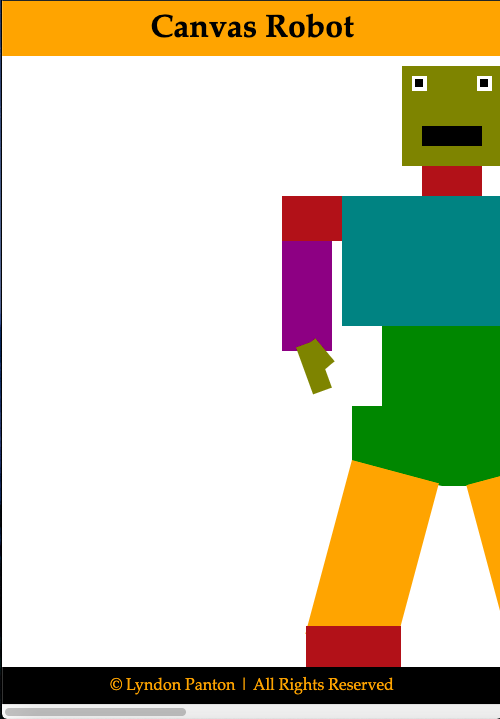

# Canvas Robot

## How To Open
> 1. Go to the project's download folder
> 2. Right click on the file named _index.html_
> 3. Choose the _open with_ option
> 4. Open the page in a browser of your choice

## How To Use
> 1. You may have to scroll to the left or increase the window width to see the drawing

## Requirements
> 1. This project requires a browser to run
> 2. The browser must have JavaScript available and enabled

## Extra Info
> 1. This was made for the w3c and Microsoft's **HTML5 Coding Essentials and Best Practices** course, the fourth for achieving the **Front End Web Developer Professional Certicate**

## Preview

